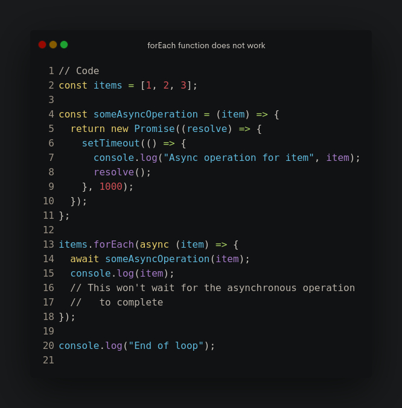
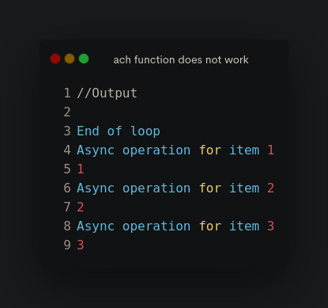
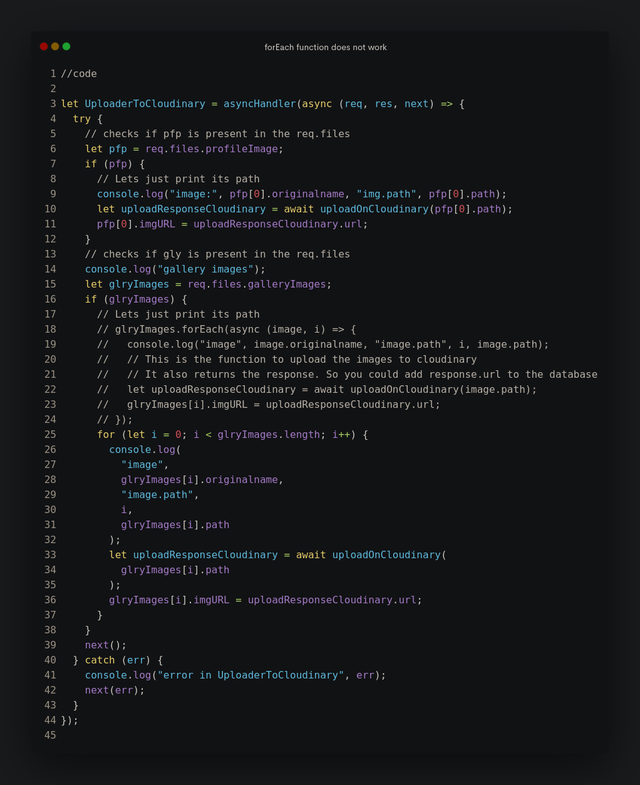

# JS Array Functions

So we all learn these functions  
map, filter, forEach, reduce  
But these are not as good as they seem.  

We need to be careful of them.  

As they do not seem to have the ability to work with  
`async and await`. Thus its not that useful for me.  

I will prefer the old school way of normal loops  
As honestly they seem more logical and convenient to me.  

Here are a few images to demonstrate the reasons.

## Now the exact code troubling me

